# PRACTICAL 01  |  Git Installation, Configuration & First Repository
## Install Git on your Ubuntu VM and verify the installation by running git --version. Screenshot the terminal output. 
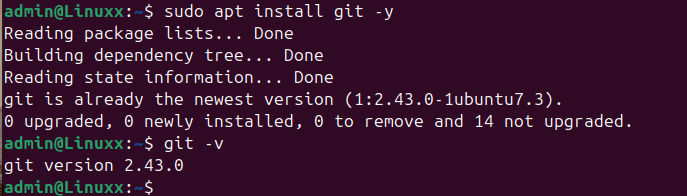
## Configure your global Git identity: set user.name and user.email. 
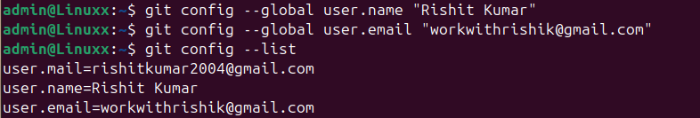
## Create a directory called git-nginx-assessment, initialise a Git repository inside it. 
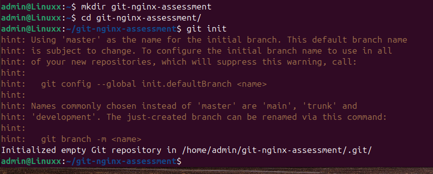
## Create two files: README.md (with a project title and your name) and app.py (with a print('Hello Git') statement). 
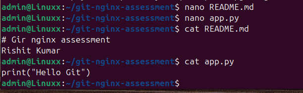
## Stage both files and make your first commit with the message: 'Initial commit: add README and app.py'. 
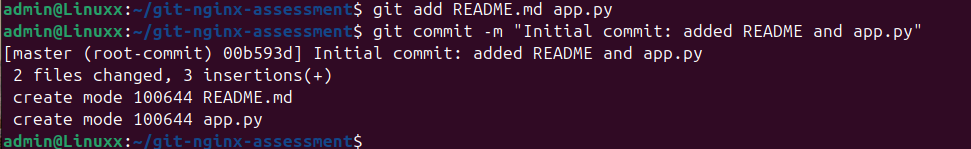
## Run git log and screenshot the output showing the commit hash, author, date, and message. 
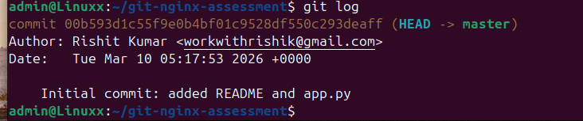

# PRACTICAL 02  |  Branching, Committing & Pull Request Workflow 
## From the main/master branch, create a new branch named feature/add-calculator following Git naming best practices. 
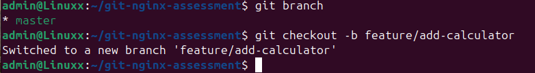
## Switch to the new branch and add a file calculator.py with at least two Python functions (e.g., add, subtract). 
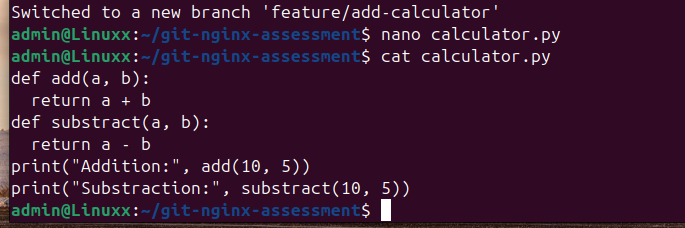
## Stage and commit this file with a clear, imperative commit message. 
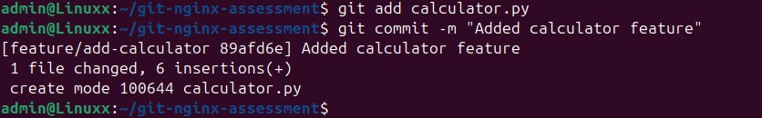
## Make a second commit on this branch: update README.md to mention the new calculator module. 
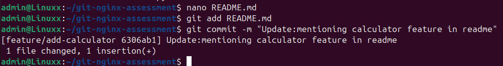
## Push the feature branch to GitHub and open a Pull Request (PR) against main/master. 
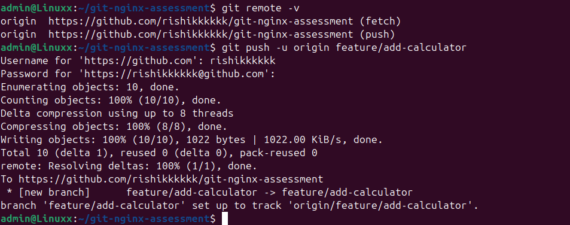
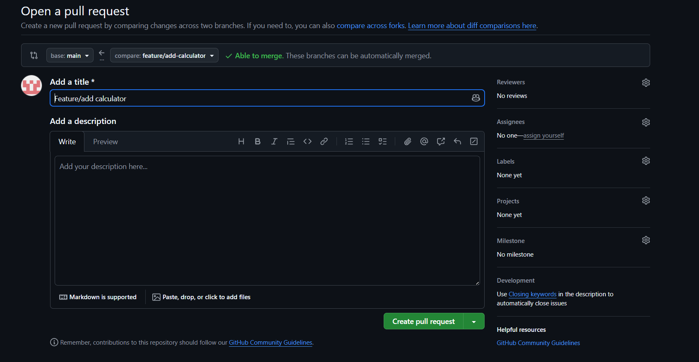
## Screenshot the PR page on GitHub showing the branch comparison, commit list, and file diff. 
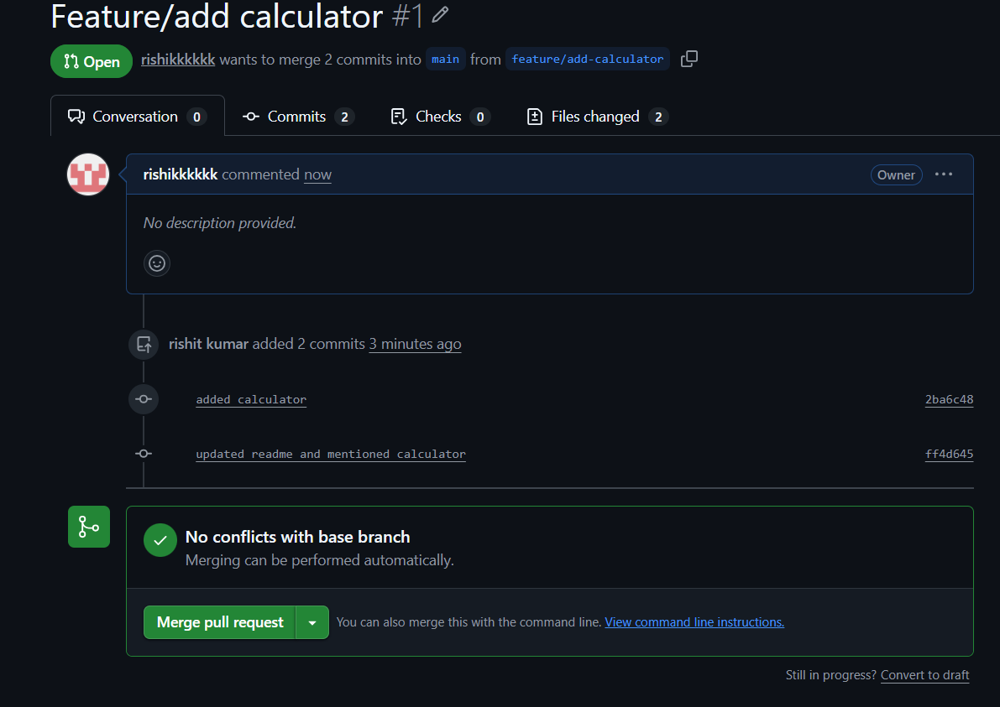
## Merge the PR on GitHub, then pull the updated main branch locally. 
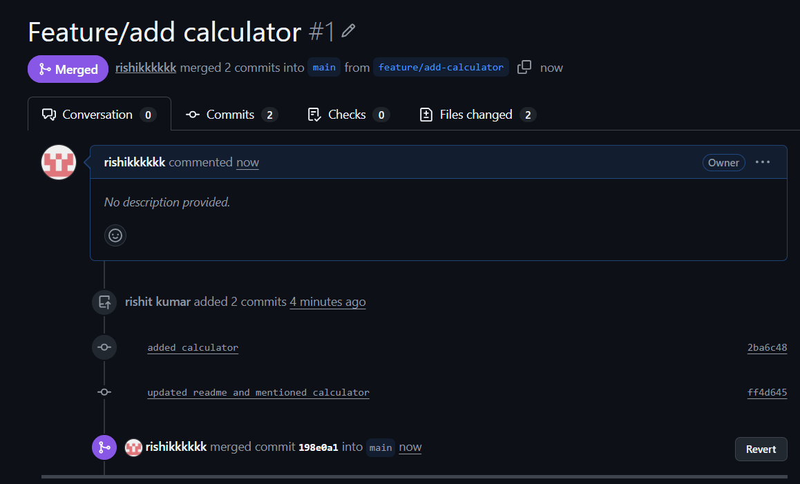
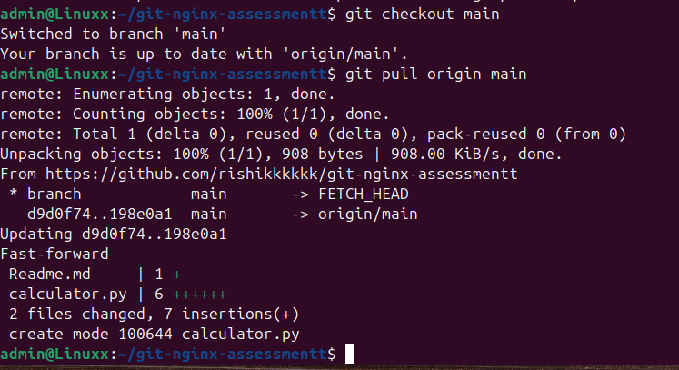

# PRACTICAL 03  |  Stash, Undo & History (Revert, Reset, Amend)
## On a new branch called bugfix/stash-demo, modify app.py (add a comment or a line). Without committing, run git stash. Verify app.py is clean using git status. Pop the stash and confirm the changes return.
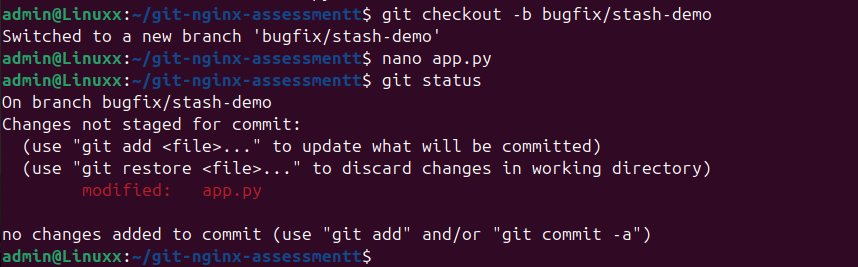
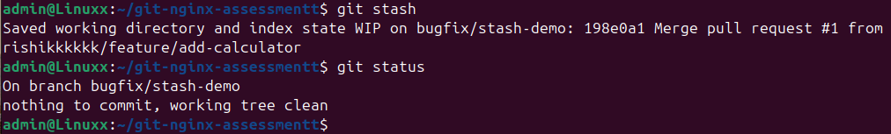
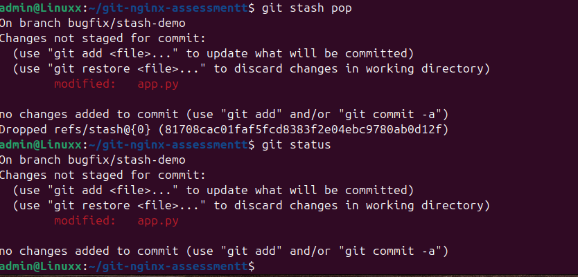
## Create and commit a file named bug.txt with content 'This is a bug'. Then use git revert to undo this commit. Screenshot git log --oneline showing both the original commit and the revert commit. 
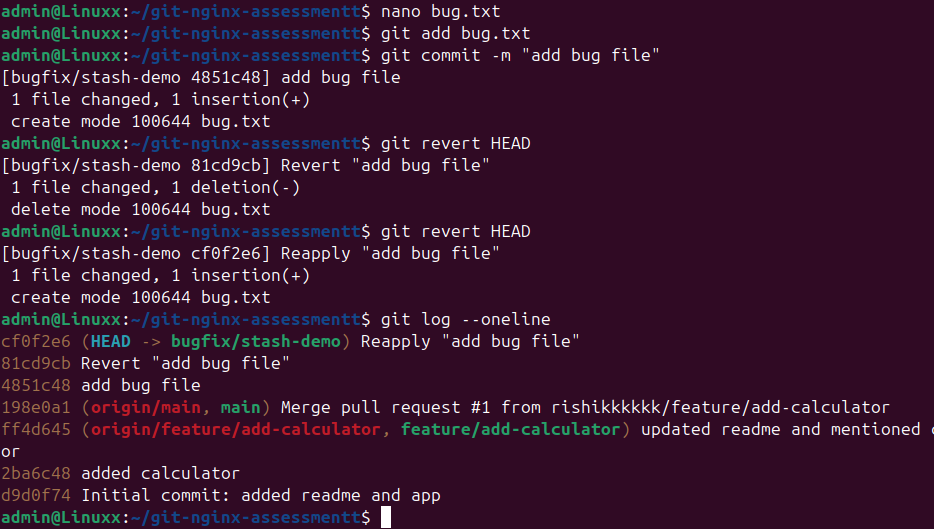
## Create a file hotfix.txt, stage it, then commit it. Use git commit --amend -m 'fix: hotfix with  corrected message' to update the commit message. Show git log --oneline before and after. 
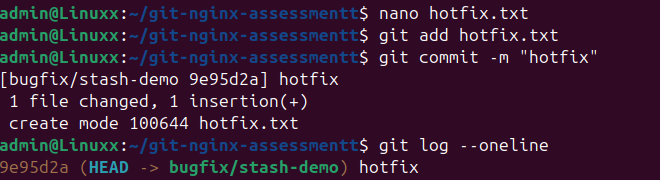
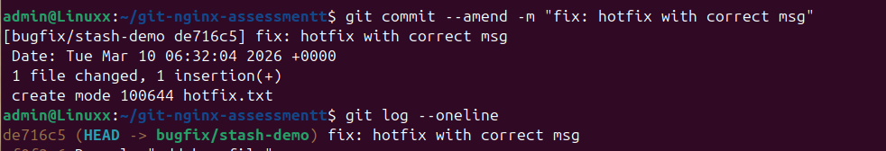
## Make two more commits. Use git reset --soft HEAD~1 to un-commit the last change while keeping it staged. Screenshot git status showing the staged file.
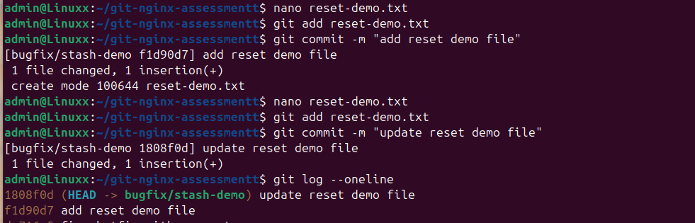
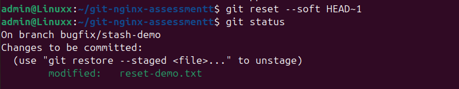

#  PRACTICAL 04  |  NGINX Install, Config & Hosting Multiple Static Sites
## Install NGINX on Ubuntu and verify it is running with systemctl status nginx. Enable it to start on boot.
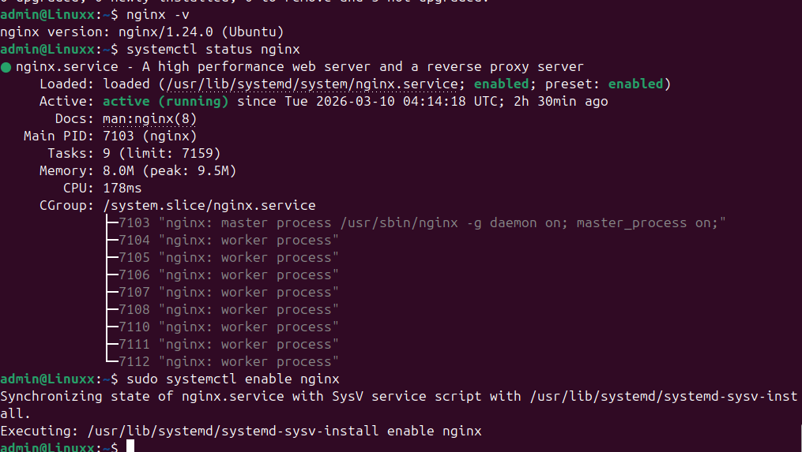
## Run sudo nginx -t to confirm the default config is valid. Screenshot the output. 
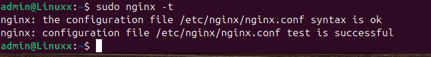
## Create two separate site directories: /var/www/app1.local/html and /var/www/app2.local/html. Add a unique index.html to each (e.g., 'Welcome to App 1' and 'Welcome to App 2'). 
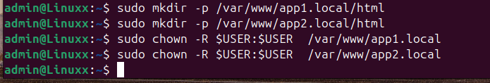
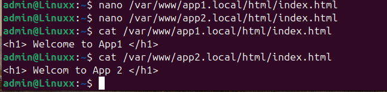
## Create NGINX server block config files for app1.local and app2.local in /etc/nginx/sites-available/. Each block must set listen 80, server_name, root, and a location / block with try_files. 
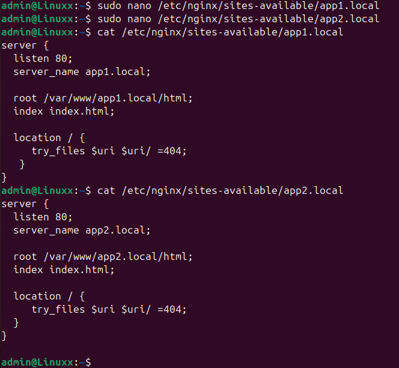
## Enable both sites using symlinks to sites-enabled. Test the config and reload NGINX. 
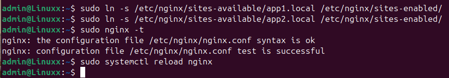
## Add both domains to /etc/hosts pointing to 127.0.0.1. Run curl http://app1.local and curl http://app2.local and screenshot both responses.
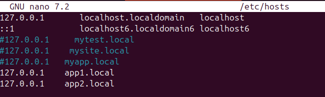
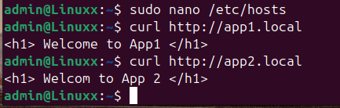

# PRACTICAL 05  |  Reverse Proxy with Docker Backend
## Pull and run an nginx:alpine Docker container as a backend app on port 8080: docker run -d -p 8080:80 --name backend-app nginx:alpine. Verify it responds with curl http://localhost:8080. 
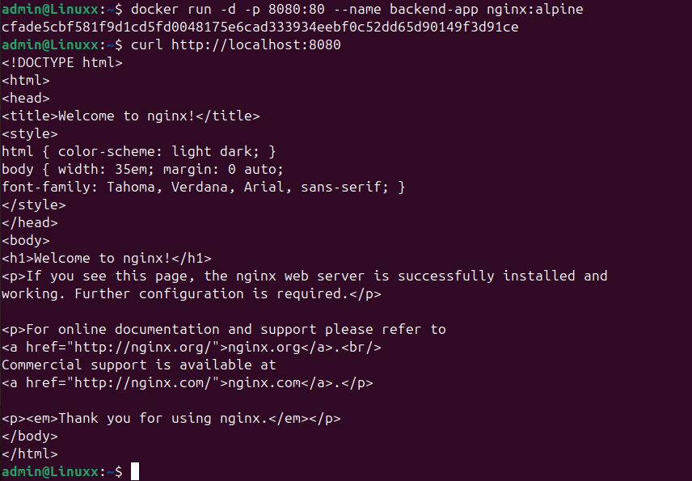
## Create a new NGINX site config at /etc/nginx/sites-available/myapp.local that proxies all requests to http://127.0.0.1:8080 using proxy_pass. 
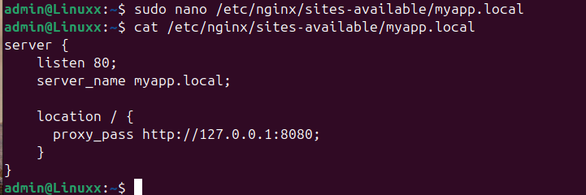
## Include all four required proxy headers: Host, X-Real-IP, X-Forwarded-For, X-Forwarded-Proto. 
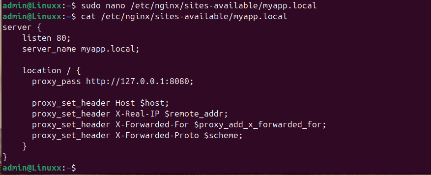
## Enable the site, test the config, reload NGINX. Add myapp.local to /etc/hosts. 
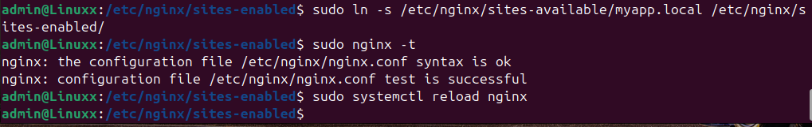
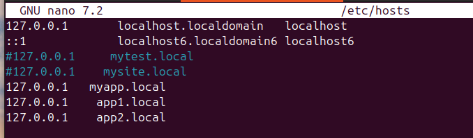
## Run curl http://myapp.local and screenshot the response proving NGINX is proxying to the Docker backend. 
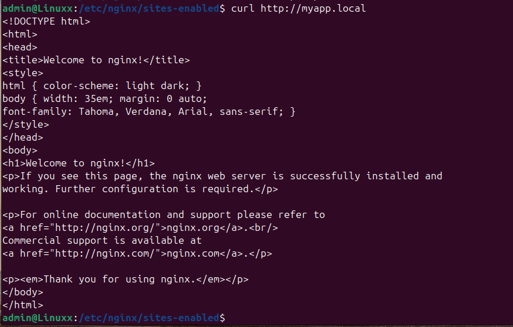
## Explain in your README what each proxy_set_header directive does and why it matters. 
### proxy_set_header Host $host : Preserves the original host header from the client request.
### proxy_set_header X-Real-IP $remote_addr : Sends the real client IP address to the backend server.
### proxy_set_header X-Forwarded-For $proxy_add_x_forwarded_for : Maintains a chain of client IP addresses through proxies.
### proxy_set_header X-Forwarded-Proto $scheme : Tells the backend whether the original request used HTTP or HTTPS.

# PRACTICAL 06  |  SSL/TLS, Load Balancing & Merge Conflict Resolution
##  [SSL Concept — Local Self-Signed Cert] Generate a self-signed SSL certificate using openssl: openssl req -x509 -nodes -days 365 -newkey rsa:2048 -keyout /etc/ssl/private/myapp.key -out /etc/ssl/certs/myapp.crt. Update the myapp.local NGINX config to listen on port 443 with ssl_certificate and ssl_certificate_key directives. Test with curl -k https://myapp.local.
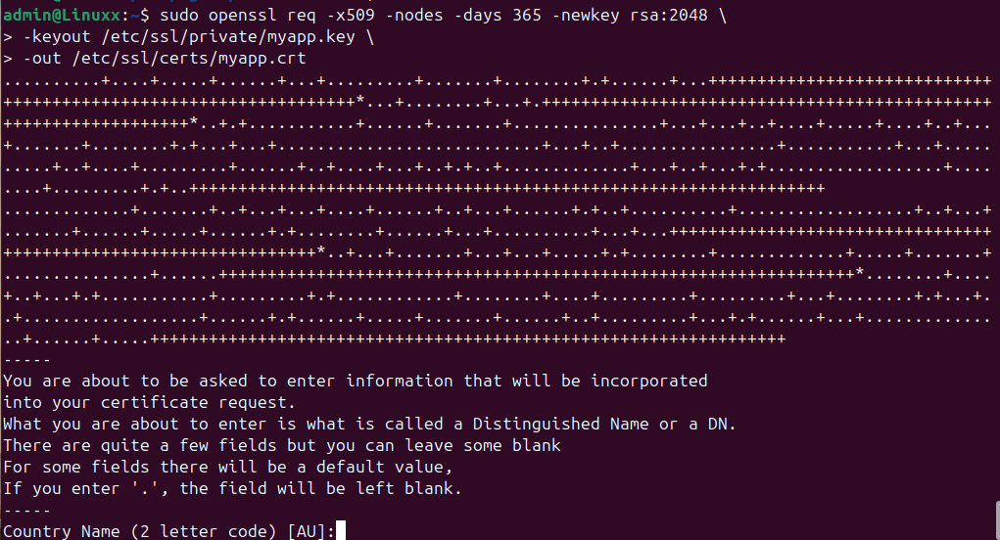
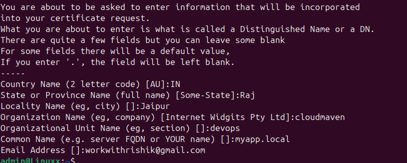
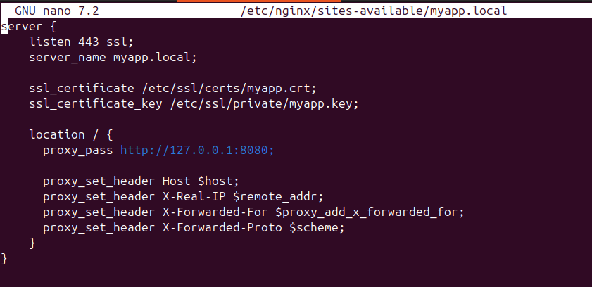
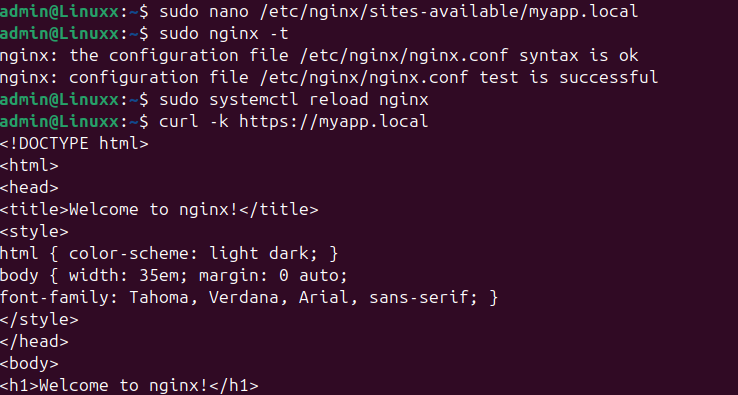
## [Load Balancer Config] Create a new NGINX config file that defines an upstream block with two backend entries (they can both point to 127.0.0.1:8080 for this exercise). Configure NGINX to proxy_pass to this upstream group. Reload and verify. 

## [Merge Conflict] On your main branch, edit README.md — change the first heading. Commit this. Now create a branch conflict-demo, also edit the same first heading to something different. Commit on conflict-demo. Merge conflict-demo into main — resolve the conflict manually, mark it ommit the merge. Screenshot the conflict markers before resolution and git log -
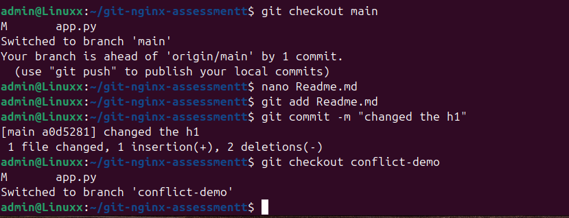
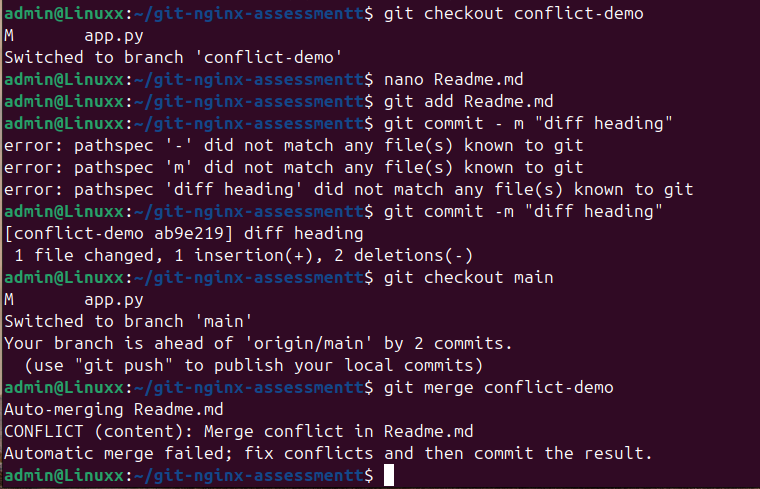
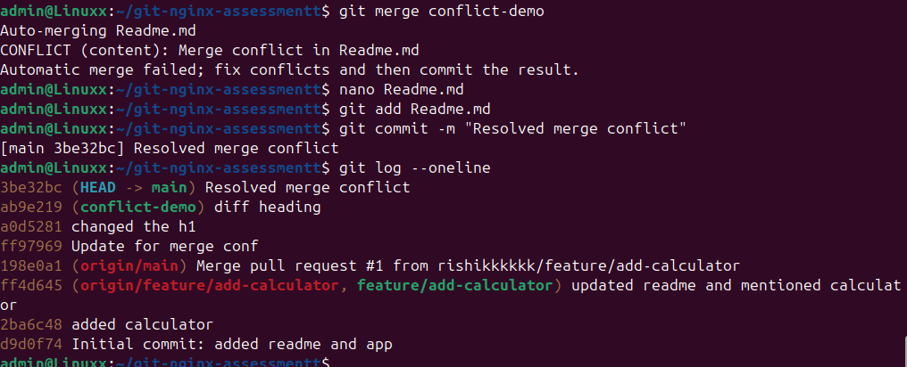